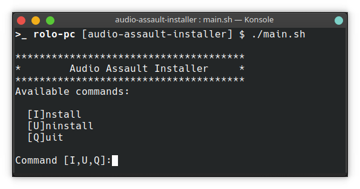

# audio-assault-installer
An installer for [Audio Assault](https://audio-assault.com/) Linux Software.

This is an installer for some cool guitar audio software from Audio Assault that I use on my Linux Box. This installer extracts and install the stuff from the given zip packages.

## Software
The ZIP packages **must be** on the same directory before executing the install script.
* Duality [version 1.2.51]
* RVXX [version 1.0.1]
* Sigma [version 1.0.2]

## Usage
Clone repo and execute install script and follow the instructions.

    git clone https://github.com/rolodoom/audio-assault-installer.git
    cd audio-assault-installer
    chmod +x main.sh && ./main.sh
